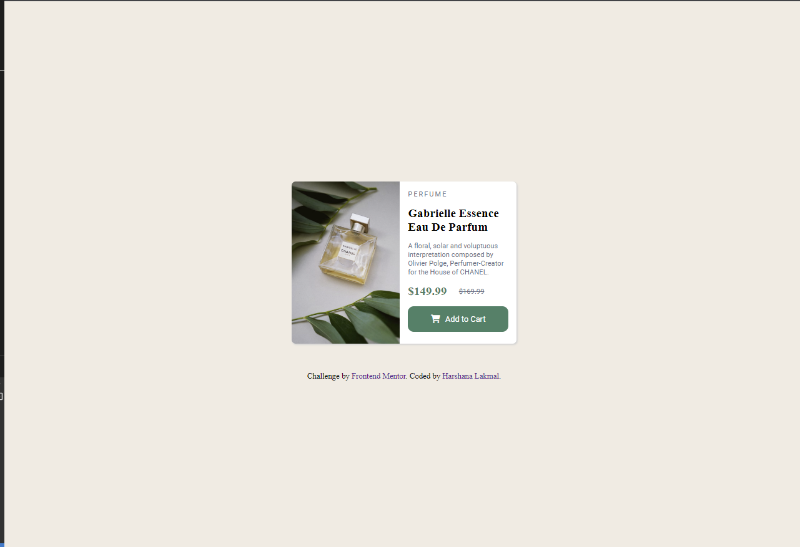
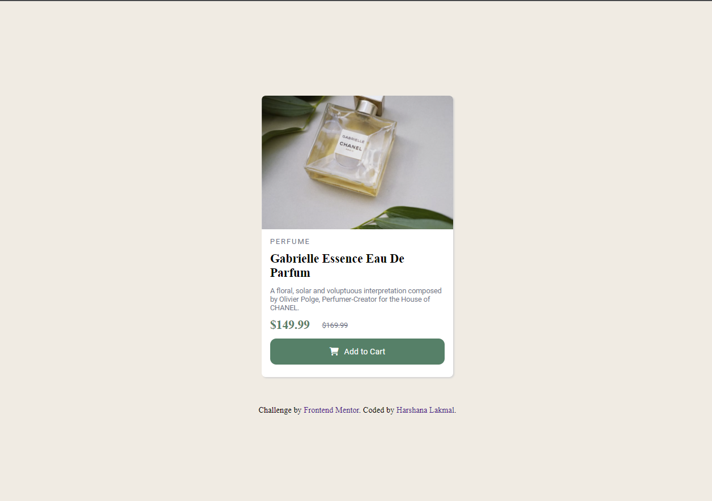

# Frontend Mentor - Product preview card component

#### Desktop View

#### Mobile View

## Welcome! 👋

Thanks for checking out my solution for this front-end coding challenge.

[Frontend Mentor](https://www.frontendmentor.io) challenges help you improve your coding skills by building realistic projects.

__

## The challenge

My challenge is to build out the product preview card component and get responsiveness for different screen sizes.

## Building Solution

In this project I use,
1.HTML
2.CSS
3.Sass

 
## Give a feedback for me

I love receiving feedback! I am always looking to improve my coding journey. So if you have anything you'd like to mention, please mention it.

This challenge is completely free. Please share it with anyone who will find it useful for practice.

**Thank You!** 🚀
